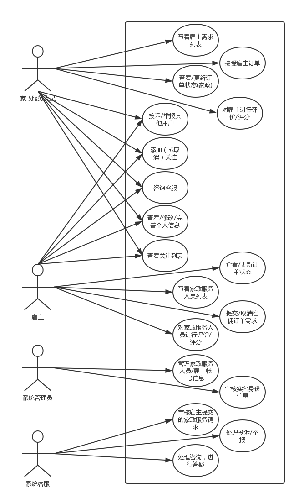

<!-- footer: 脏了吗家政外包平台    用例文档 一根藤上三个娃 team-->
<!-- page_number: true -->
<!-- $height:1640 -->
<!-- $width:1050 -->

# 
 家政服务O2O一体化系统

## 
 用例文档 

## 
 V1.0 

     
### 需求方提出的问题：
- 随着城市发展节奏加快，家政服务的需求增长明显，而目前家政服务的获取、以及家政人力资源的调度处于一个比较盲目的阶段，尚未有一个一体化、定制化、专业化的家政外包的O2O平台。
- 现有的家政服务平台安全性不高，家政服务人员的质量参差不齐，家政服务资源并没有得到最有效的利用
- 现有平台没有解决安全性的重要问题。

___

# 
更新历史

  

|  日期 | 更新者 | 更新内容 | 版本号 |
|:--:|:--:|:--:|:--:|
| 2018.10.22|王冬杨 |小组讨论后第一版定稿 |V 1.0|

___

# 
目录

- 一、引言. . . . . . . . . . . . . . . . . . . . . . . . . . . . . . . . . . . . . . . .4
- - 1.1目的. . . . . . . . . . . . . . . . . . . . . . . . . . . . . . . . . . . . . 4
- - 1.2阅读说明. . . . . . . . . . . . . . . . . . . . . . . . . . . . . . . . . .4
- - 1.3参考文献. . . . . . . . . . . . . . . . . . . . . . . . . . . . . . . . . .4
- 二、用例列表. . . . . . . . . . . . . . . . . . . . . . . . . . . . . . . . . . . . 5
- 三、用例图. . . . . . . . . . . . . . . . . . . . . . . . . . . . . . . . . . . . . . 6
- 四、详细用例描述. . . . . . . . .. . . . . . . . . . . . . . . . . . . . . . . . 7
- - UC1 查看雇主需求列表. . . . . . . . . . . . . . . . . . . . . . . . . 8
- - UC2 接受雇主订单.. . . . . . . . . . . . . . . . . . . . . . . . . . . . 9
-  - UC3 查看/更新订单状态(家政服务人员) . . . . . . . . . . . .10
-  - UC4 对雇主进行评价/评分. . . . . . . . . . . . . . . . . .. . .  . . 11
-  - UC5 提交/取消家政雇佣订单需求. .. .  . . . . . . . . . . .. . . 12
-  - UC6 查看/更新订单状态(雇主). . . . . . . . . . . . . . . ..  . . . 13
-  - UC7 查看家政服务人员. . .. . . . . . . . . . . . . . . . .. . . . . . 14
-  - UC8 对家政服务人员进行评价/评分. . . . . . . . . . . . . . .. 15
-  - UC9 投诉/举报其他用户. . . . . . . . . . . . . . . . . . . . . . . . .16
-  - UC11 添加(或取消)关注 . . . . . . . . . . . . . . . . . . . . . . . . 17
-  - UC12 查看关注列表. .. . . . . . . . . . . . . . . . . . . . . . . . . . 18
-  - UC13 查看/修改/完善个人信息. . . . . . . . . . . . . . . .. . . .19
-  - UC14 审核雇主提交的家政服务需求. . . . . . . . . . . . . . . 20
-  - UC15 处理投诉/举报 . . . . . . . . . . . . . . . . .. .. . . . . . . . .21
-  - UC16 处理咨询，进行答疑. . . . . . . . . . . . .. . . .. . . . . . 22
-  - UC17 管理家政服务人员/雇主帐号信息 . . . . . . . . . . . ..23
-  - UC18 审核实名身份信息.. . . . . . . . . . . . . . . . .. . . . . . . 24
-  五、用户需求列表. . . . . . . . . . . . . . . . . . . . . . . . . . . . . . . . . 25
-  六、跟踪矩阵. . . . . . . . . . . . . . . . . . . . . . . . . . . . . . . . . . . . .26
___

# 一、引言

## 1.1目的

本文当描述了家政服务一体化系统的用例图及用例文档

 

## 1.2 阅读说明

用例描述的约定为必须要包含用例 ID、名称、创建日期、最
后一次更新日期、参与者、触发条件、前置条件、后置条件、优先
级、正常流程、扩展流程特殊需求。其中流程要完整有序地描述该
用例中使用者与系统的交互。

 

## 1.3 参考文献

《软件工程与计算(卷二)软件开发的技术基础》

《需求工程——软件建模与分析(第二版)》

___

# 二、用例列表

<table>
  <tr>
    <th>参与者</th>
    <th align = "center">用例编号</th>
    <th>用例名称</th>
  </tr>
  <tr>
	<td rowspan="4">家政服务人员</td>
  	<td align = "center">1</td>
    <td>查看雇主需求列表</td>
  </tr>
  <tr>
    <td align = "center">2</td>
    <td>接收雇主订单</td>
  </tr>
  
  <tr>
    <td align = "center">3</td>
    <td>查看/更新订单状态</td>
  </tr>
  <tr>
    <td align = "center">4</td>
    <td>对雇主进行评价/评分</td>
  </tr>
  <tr>
    <td rowspan = "4">雇主</td>
    <td align = "center">5</td>
  	<td>提交/取消家政雇用订单需求</td>
  </tr>
  <tr>
    <td align = "center">6</td>
    <td>查看/更新订单状态</td>
  </tr>
  <tr>
    <td align = "center">7</td>
    <td>查看家政服务人员列表</td>
  </tr>
  <tr>
    <td align = "center">8</td>
    <td>对家政服务人员进行评价/评分</td>
  </tr>
  <tr>
  	<td rowspan = "5">家政服务人员/雇主</td>
    <td align = "center">9</td>
    <td>投诉/举报其他用户</td>
  </tr>
  <tr>
    <td align = "center">10</td>
    <td>咨询客服</td>
  </tr>
   <tr>
    <td align = "center">11</td>
    <td>添加（或取消）关注</td>
  </tr>
  <tr>
    <td align = "center">12</td>
    <td>查看关注列表</td>
  </tr>
   <tr>
    <td align = "center">13</td>
    <td>查看/修改/完善个人信息</td>
  </tr>
  <tr>
    <td rowspan = "3"> 系统客服</td>
    <td align = "center">14</td>
    <td>审核雇主提交的家政服务需求</td>
  </tr>
  <tr>
    <td align = "center">15</td>
    <td>处理投诉/举报</td>
  </tr>
  <tr>
    <td align = "center">16</td>
    <td>处理咨询，进行答疑</td>
  </tr>
  <tr>
    <td rowspan = "2">系统管理员</td>
    <td align = "center">17</td>
    <td>管理家政服务人员/雇主帐号信息</td>
  </tr>
  <tr>
    <td  align = "center">18</td>
    <td> 审核实名身份信息</td>
  </tr>
</table>

___
# 三、用例图

___
# 四、详细用例描述

<table>
  <tr>
    <td bgcolor="#aa70aa">ID</td>
    <td>UC1</td>
    <td bgcolor="#aa70aa">名称</td>
    <td>查看雇主需求列表</td>
  </tr>
  <tr>
    <td bgcolor="#aa70aa">创建者</td>
    <td>王冬杨</td>
    <td bgcolor="#aa70aa">最后一次更新者</td>
    <td>王冬杨</td>
  </tr>
  <tr>
    <td bgcolor="#aa70aa">创建日期</td>
    <td>2018.10.22&emsp;&emsp;</td>
    <td bgcolor="#aa70aa">最后更新日期</td>
    <td>2018.10.22</td>
  </tr>
  <tr>
    <td bgcolor="#aa70aa">参与者</td>
    <td colspan = "3">家政服务人员</td>
  </tr>
  <tr>
    <td bgcolor="#aa70aa">触发条件</td>
    <td colspan = "3"> 家政服务人员需要查看订单列表,寻找适合自己的订单</td>
  </tr>
  <tr>
    <td bgcolor="#aa70aa">前置条件</td>
    <td colspan = "3">家政服务人员联网，并已经实名登录</td>
  </tr>
  <tr>
    <td bgcolor="#aa70aa">后置条件</td>
    <td colspan = "3">无</td>
  </tr>
  <tr>
    <td bgcolor="#aa70aa">优先级</td>
    <td colspan = "3">3</td>
  </tr>
  <tr>
    <td bgcolor="#aa70aa">正常流程</td>
    <td colspan = "3">1、家政服务人员向系统发起查询请求 2、系统向用户显示相同城市的雇主需求订单 3、家政服务人员选择一个订单，向系统发起查看详情请求 4、系统进入单个订单的详细信息显示界面 5、家政服务人员完成查看，退出查询</td>
  </tr>
  <tr>
    <td bgcolor="#aa70aa">扩展流程</td>
    <td colspan = "3">2a、当前相同城市暂时没有家政服务订单 &emsp;1、系统提示没有订单 &emsp;2、退出查询 4a、用户想继续浏览所有订单 &emsp;1、返回正常流程2</td>
  </tr>
  <tr>
    <td bgcolor="#aa70aa">特殊需求</td>
    <td colspan = "3">可以按照距离、价格、雇主评分进行排序显示</td>
  </tr>
</table>

___
# 四、详细用例描述

<table>
  <tr>
    <td bgcolor="#aa70aa">ID</td>
    <td>UC2</td>
    <td bgcolor="#aa70aa">名称</td>
    <td>接受雇主订单</td>
  </tr>
  <tr>
    <td bgcolor="#aa70aa">创建者</td>
    <td>王冬杨</td>
    <td bgcolor="#aa70aa">最后一次更新者</td>
    <td>王冬杨</td>
  </tr>
  <tr>
    <td bgcolor="#aa70aa">创建日期</td>
    <td>2018.10.22&emsp;&emsp;</td>
    <td bgcolor="#aa70aa">最后更新日期</td>
    <td>2018.10.22</td>
  </tr>
  <tr>
    <td bgcolor="#aa70aa">参与者</td>
    <td colspan = "3">家政服务人员</td>
  </tr>
  <tr>
    <td bgcolor="#aa70aa">触发条件</td>
    <td colspan = "3"> 家政服务人员选择一个订单，并接单</td>
  </tr>
  <tr>
    <td bgcolor="#aa70aa">前置条件</td>
    <td colspan = "3">家政服务人员当前没有未完成的订单，且满足订单要求(例如评分足够高等)</td>
  </tr>
  <tr>
    <td bgcolor="#aa70aa">后置条件</td>
    <td colspan = "3">家政服务人员获得该订单，订单状态变为“进行中”，通知订单双方</td>
  </tr>
  <tr>
    <td bgcolor="#aa70aa">优先级</td>
    <td colspan = "3">5</td>
  </tr>
  <tr>
    <td bgcolor="#aa70aa">正常流程</td>
    <td colspan = "3">1、家政服务人员向系统发起接单请求 2、系统检查家政服务人员是否满足订单要求 &emsp;2a、家政服务人员不满足订单要求 &emsp;&emsp;1、系统提示不满足订单条件 &emsp;&emsp;2、退出接单 &emsp;2b、家政服务人员满足订单要求 &emsp;&emsp;1、家政服务人员获得该订单 &emsp;&emsp;2、系统向订单双方发出通知 &emsp;&emsp;3、系统改变订单状态为“进行中”</td>
  </tr>
  <tr>
    <td bgcolor="#aa70aa">扩展流程</td>
    <td colspan = "3">2aa、系统提供给用户改进建议，例如进行实名认证。 2ab、用户可以选择咨询客服。</td>
  </tr>
  <tr>
    <td bgcolor="#aa70aa">特殊需求</td>
    <td colspan = "3">系统需要用户进行二次确认，防止操作失误。</td>
  </tr>
</table>

___
# 四、详细用例描述

<table>
  <tr>
    <td bgcolor="#aa70aa">ID</td>
    <td>UC3</td>
    <td bgcolor="#aa70aa">名称</td>
    <td>查看/更新订单状态</td>
  </tr>
  <tr>
    <td bgcolor="#aa70aa">创建者</td>
    <td>王冬杨</td>
    <td bgcolor="#aa70aa">最后一次更新者</td>
    <td>王冬杨</td>
  </tr>
  <tr>
    <td bgcolor="#aa70aa">创建日期</td>
    <td>2018.10.22&emsp;&emsp;</td>
    <td bgcolor="#aa70aa">最后更新日期</td>
    <td>2018.10.22</td>
  </tr>
  <tr>
    <td bgcolor="#aa70aa">参与者</td>
    <td colspan = "3">家政服务人员</td>
  </tr>
  <tr>
    <td bgcolor="#aa70aa">触发条件</td>
    <td colspan = "3"> 家政服务人员需要查看进行中/已完成的订单，或手动改变订单状态</td>
  </tr>
  <tr>
    <td bgcolor="#aa70aa">前置条件</td>
    <td colspan = "3">家政服务人员存在进行中/已完成的订单，或进行中的订单状态需要手动改变</td>
  </tr>
  <tr>
    <td bgcolor="#aa70aa">后置条件</td>
    <td colspan = "3">更新订单状态</td>
  </tr>
  <tr>
    <td bgcolor="#aa70aa">优先级</td>
    <td colspan = "3">4</td>
  </tr>
  <tr>
    <td bgcolor="#aa70aa">正常流程</td>
    <td colspan = "3">1、家政服务人员向系统发起查看订单状态请求 2、系统显示该订单详细信息，并高亮显示当前状态 3、家政服务人员结束查看，退出</td>
  </tr>
  <tr>
    <td bgcolor="#aa70aa">扩展流程</td>
    <td colspan = "3">2a、家政服务人员手动改变订单状态 &emsp;1、系统向雇主发起状态改变确认请求 &emsp;&emsp;1a、雇主确认 &emsp;&emsp;&emsp;1、更新订单状态 &emsp;&emsp;1b、雇主拒绝 &emsp;&emsp;&emsp;1、不更新订单状态，提示家政服务人员请求被拒绝</td>
  </tr>
  <tr>
    <td bgcolor="#aa70aa">特殊需求</td>
    <td colspan = "3">可以向客服提出申诉/举报，或者咨询 可以选择对该订单进行评价，对雇主进行评分</td>
  </tr>
</table>

___
# 四、详细用例描述

<table>
  <tr>
    <td bgcolor="#aa70aa">ID</td>
    <td>UC4</td>
    <td bgcolor="#aa70aa">名称</td>
    <td>对雇主进行评价/评分</td>
  </tr>
  <tr>
    <td bgcolor="#aa70aa">创建者</td>
    <td>王冬杨</td>
    <td bgcolor="#aa70aa">最后一次更新者</td>
    <td>王冬杨</td>
  </tr>
  <tr>
    <td bgcolor="#aa70aa">创建日期</td>
    <td>2018.10.22&emsp;&emsp;</td>
    <td bgcolor="#aa70aa">最后更新日期</td>
    <td>2018.10.22</td>
  </tr>
  <tr>
    <td bgcolor="#aa70aa">参与者</td>
    <td colspan = "3">家政服务人员</td>
  </tr>
  <tr>
    <td bgcolor="#aa70aa">触发条件</td>
    <td colspan = "3"> 家政服务人员完成订单后，对该订单进行评价/评分</td>
  </tr>
  <tr>
    <td bgcolor="#aa70aa">前置条件</td>
    <td colspan = "3">订单已完成，并且评价/评分请求发生在完成订单15天内。</td>
  </tr>
  <tr>
    <td bgcolor="#aa70aa">后置条件</td>
    <td colspan = "3">系统记录订单的评价、雇主的评分</td>
  </tr>
  <tr>
    <td bgcolor="#aa70aa">优先级</td>
    <td colspan = "3">2</td>
  </tr>
  <tr>
    <td bgcolor="#aa70aa">正常流程</td>
    <td colspan = "3">1、家政服务人员向系统发起评价/评分请求 2、系统检查订单状态以及是否满足时间要求 &emsp;2a、订单状态不是“已完成”或者距离订单完成超过15天 &emsp;&emsp;1、系统提示不满足评价/评分限制并退出 &emsp;2b、订单状态为“已完成”，并且距离完成不满15天 &emsp;&emsp;1、系统进入评价/评分界面，提示用户进行相应操作 &emsp;&emsp;2、用户填写评价，或对雇主进行评分，并填写理由 &emsp;&emsp;3、用户提交评价或评分 &emsp;&emsp;4、系统更新订单评价或者雇主评分</td>
  </tr>
  <tr>
    <td bgcolor="#aa70aa">扩展流程</td>
    <td colspan = "3">2b:4a当家政服务人员只进行了一项评价/评分，提醒用户可以进行另外一项的评价/评分 2b:4a当评分较高时，提示可以关注该雇主</td>
  </tr>
  <tr>
    <td bgcolor="#aa70aa">特殊需求</td>
    <td colspan = "3">无</td>
  </tr>
</table>

___
# 四、详细用例描述

<table>
  <tr>
    <td bgcolor="#aa70aa">ID</td>
    <td>UC5</td>
    <td bgcolor="#aa70aa">名称</td>
    <td>提交/取消家政雇佣订单需求</td>
  </tr>
  <tr>
    <td bgcolor="#aa70aa">创建者</td>
    <td>王冬杨</td>
    <td bgcolor="#aa70aa">最后一次更新者</td>
    <td>王冬杨</td>
  </tr>
  <tr>
    <td bgcolor="#aa70aa">创建日期</td>
    <td>2018.10.22&emsp;&emsp;</td>
    <td bgcolor="#aa70aa">最后更新日期</td>
    <td>2018.10.22</td>
  </tr>
  <tr>
    <td bgcolor="#aa70aa">参与者</td>
    <td colspan = "3">雇主</td>
  </tr>
  <tr>
    <td bgcolor="#aa70aa">触发条件</td>
    <td colspan = "3"> 雇主有家政服务需求</td>
  </tr>
  <tr>
    <td bgcolor="#aa70aa">前置条件</td>
    <td colspan = "3">雇主已经联网，并实名登录</td>
  </tr>
  <tr>
    <td bgcolor="#aa70aa">后置条件</td>
    <td colspan = "3">订单提交至客服人员进行审核</td>
  </tr>
  <tr>
    <td bgcolor="#aa70aa">优先级</td>
    <td colspan = "3">5</td>
  </tr>
  <tr>
    <td bgcolor="#aa70aa">正常流程</td>
    <td colspan = "3">1、雇主向系统发起创建订单请求 2、系统进入订单填写界面 3、雇主填写相关信息 4、雇主完成信息填写，发起提交申请 5、系统将该订单提交至客服人员处审核，保存该订单，状态位“待审核” 6、提示雇主提交成功，并退出</td>
  </tr>
  <tr>
    <td bgcolor="#aa70aa">扩展流程</td>
    <td colspan = "3">1a、雇主选择取消订单 &emsp;1系统撤销该订单 3a、订单信息不完整 &emsp;1、系统提示订单信息不完整 &emsp;2、系统将空缺的信息高亮显示，并返回3</td>
  </tr>
  <tr>
    <td bgcolor="#aa70aa">特殊需求</td>
    <td colspan = "3">可以对城市、街道以及邮编等项进行自动补全 用户可以在地图上选择地址</td>
  </tr>
</table>

___
# 四、详细用例描述

<table>
  <tr>
    <td bgcolor="#aa70aa">ID</td>
    <td>UC6</td>
    <td bgcolor="#aa70aa">名称</td>
    <td>查看/更新订单状态</td>
  </tr>
  <tr>
    <td bgcolor="#aa70aa">创建者</td>
    <td>王冬杨</td>
    <td bgcolor="#aa70aa">最后一次更新者</td>
    <td>王冬杨</td>
  </tr>
  <tr>
    <td bgcolor="#aa70aa">创建日期</td>
    <td>2018.10.22&emsp;&emsp;</td>
    <td bgcolor="#aa70aa">最后更新日期</td>
    <td>2018.10.22</td>
  </tr>
  <tr>
    <td bgcolor="#aa70aa">参与者</td>
    <td colspan = "3">雇主</td>
  </tr>
  <tr>
    <td bgcolor="#aa70aa">触发条件</td>
    <td colspan = "3"> 雇主需要查看历史订单，或者进行中的订单，或者需要对订单状态进行手动更新</td>
  </tr>
  <tr>
    <td bgcolor="#aa70aa">前置条件</td>
    <td colspan = "3">雇主已经联网，并实名登录</td>
  </tr>
  <tr>
    <td bgcolor="#aa70aa">后置条件</td>
    <td colspan = "3">无</td>
  </tr>
  <tr>
    <td bgcolor="#aa70aa">优先级</td>
    <td colspan = "3">4</td>
  </tr>
  <tr>
    <td bgcolor="#aa70aa">正常流程</td>
    <td colspan = "3">1、雇主向系统发起查看订单状态请求 2、系统显示该订单详细信息，并高亮显示当前状态 3、雇主结束查看，退出</td>
  </tr>
  <tr>
    <td bgcolor="#aa70aa">扩展流程</td>
    <td colspan = "3">2a、雇主手动改变订单状态 &emsp;1、系统向家政服务人员发起状态改变确认请求 &emsp;&emsp;1a、家政服务人员确认 &emsp;&emsp;&emsp;1、更新订单状态 &emsp;&emsp;1b、家政服务人员拒绝 &emsp;&emsp;&emsp;1、不更新订单状态，提示雇主请求被拒绝</td>
  </tr>
  <tr>
    <td bgcolor="#aa70aa">特殊需求</td>
    <td colspan = "3">可以向客服提出申诉/举报，或者咨询 可以选择对该订单进行评价，对家政服务人员进行评分</td>
  </tr>
</table>

___
# 四、详细用例描述

<table>
  <tr>
    <td bgcolor="#aa70aa">ID</td>
    <td>UC7</td>
    <td bgcolor="#aa70aa">名称</td>
    <td>查看家政服务人员列表</td>
  </tr>
  <tr>
    <td bgcolor="#aa70aa">创建者</td>
    <td>王冬杨</td>
    <td bgcolor="#aa70aa">最后一次更新者</td>
    <td>王冬杨</td>
  </tr>
  <tr>
    <td bgcolor="#aa70aa">创建日期</td>
    <td>2018.10.22&emsp;&emsp;</td>
    <td bgcolor="#aa70aa">最后更新日期</td>
    <td>2018.10.22</td>
  </tr>
  <tr>
    <td bgcolor="#aa70aa">参与者</td>
    <td colspan = "3">雇主</td>
  </tr>
  <tr>
    <td bgcolor="#aa70aa">触发条件</td>
    <td colspan = "3"> 雇主需要查看家政服务人员列表，寻找合适的家政服务人员</td>
  </tr>
  <tr>
    <td bgcolor="#aa70aa">前置条件</td>
    <td colspan = "3">雇主已经联网，并实名登录</td>
  </tr>
  <tr>
    <td bgcolor="#aa70aa">后置条件</td>
    <td colspan = "3">无</td>
  </tr>
  <tr>
    <td bgcolor="#aa70aa">优先级</td>
    <td colspan = "3">3</td>
  </tr>
  <tr>
    <td bgcolor="#aa70aa">正常流程</td>
    <td colspan = "3">1、雇主向系统发起查询请求 2、系统向用户显示相同城市的家政服务人员的列表 3、雇主选择一个家政服务人员，向系统发起查看详细资料请求 4、系统进入单个家政服务人员的详细信息显示界面 5、雇主完成查看，退出查询</td>
  </tr>
  <tr>
    <td bgcolor="#aa70aa">扩展流程</td>
    <td colspan = "3">2a、当前相同城市暂时没有家政服务人员 &emsp;1、系统提示没有家政服务人员 &emsp;2、退出查询 4a、用户想继续浏览家政服务人员列表 &emsp;1、返回正常流程2</td>
  </tr>
  <tr>
    <td bgcolor="#aa70aa">特殊需求</td>
    <td colspan = "3">可以按照距离、从业时间、家政服务人员评分进行排序显示</td>
  </tr>
</table>

___
# 四、详细用例描述

<table>
  <tr>
    <td bgcolor="#aa70aa">ID</td>
    <td>UC8</td>
    <td bgcolor="#aa70aa">名称</td>
    <td>对家政服务人员进行评价/评分</td>
  </tr>
  <tr>
    <td bgcolor="#aa70aa">创建者</td>
    <td>王冬杨</td>
    <td bgcolor="#aa70aa">最后一次更新者</td>
    <td>王冬杨</td>
  </tr>
  <tr>
    <td bgcolor="#aa70aa">创建日期</td>
    <td>2018.10.22&emsp;&emsp;</td>
    <td bgcolor="#aa70aa">最后更新日期</td>
    <td>2018.10.22</td>
  </tr>
  <tr>
    <td bgcolor="#aa70aa">参与者</td>
    <td colspan = "3">雇主</td>
  </tr>
  <tr>
    <td bgcolor="#aa70aa">触发条件</td>
    <td colspan = "3"> 订单完成后，雇主选择对该订单进行评价/评分</td>
  </tr>
  <tr>
    <td bgcolor="#aa70aa">前置条件</td>
    <td colspan = "3">订单已完成，并且评价/评分请求发生在完成订单15天内。</td>
  </tr>
  <tr>
    <td bgcolor="#aa70aa">后置条件</td>
    <td colspan = "3">系统记录订单的评价、家政服务人员的评分</td>
  </tr>
  <tr>
    <td bgcolor="#aa70aa">优先级</td>
    <td colspan = "3">2</td>
  </tr>
  <tr>
    <td bgcolor="#aa70aa">正常流程</td>
    <td colspan = "3">1、雇主向系统发起评价/评分请求 2、系统检查订单状态以及是否满足时间要求 &emsp;2a、订单状态不是“已完成”或者距离订单完成超过15天 &emsp;&emsp;1、系统提示不满足评价/评分限制，退出 &emsp;2b、订单状态为“已完成”，并且距离完成不满15天 &emsp;&emsp;1、系统进入评价/评分界面，提示用户进行相应操作 &emsp;&emsp;2、用户填写相关信息并提交 &emsp;&emsp;4、系统更新订单评价或者家政服务人员评分</td>
  </tr>
  <tr>
    <td bgcolor="#aa70aa">扩展流程</td>
    <td colspan = "3">2b:4a当雇主只进行了一项评价/评分，提醒用户可以进行另外一项的评价/评分 2b:4b评分较高时，提示可以关注该家政服务人员</td>
  </tr>
  <tr>
    <td bgcolor="#aa70aa">特殊需求</td>
    <td colspan = "3">无</td>
  </tr>
</table>

___
# 四、详细用例描述

<table>
  <tr>
    <td bgcolor="#aa70aa">ID</td>
    <td>UC9</td>
    <td bgcolor="#aa70aa">名称</td>
    <td>投诉/举报其他用户</td>
  </tr>
  <tr>
    <td bgcolor="#aa70aa">创建者</td>
    <td>王冬杨</td>
    <td bgcolor="#aa70aa">最后一次更新者</td>
    <td>王冬杨</td>
  </tr>
  <tr>
    <td bgcolor="#aa70aa">创建日期</td>
    <td>2018.10.22&emsp;&emsp;</td>
    <td bgcolor="#aa70aa">最后更新日期</td>
    <td>2018.10.22</td>
  </tr>
  <tr>
    <td bgcolor="#aa70aa">参与者</td>
    <td colspan = "3">雇主、家政服务人员</td>
  </tr>
  <tr>
    <td bgcolor="#aa70aa">触发条件</td>
    <td colspan = "3"> 发现其他用户有违规行为，进行维权</td>
  </tr>
  <tr>
    <td bgcolor="#aa70aa">前置条件</td>
    <td colspan = "3">用户已经联网、并且实名登录、且掌握其他用户违规的证据</td>
  </tr>
  <tr>
    <td bgcolor="#aa70aa">后置条件</td>
    <td colspan = "3">系统将该投诉/举报信息提交至客服进行审核</td>
  </tr>
  <tr>
    <td bgcolor="#aa70aa">优先级</td>
    <td colspan = "3">5</td>
  </tr>
  <tr>
    <td bgcolor="#aa70aa">正常流程</td>
    <td colspan = "3">1、用户选择对其他用户投诉/举报 2、系统进入投诉/举报信息填写界面 3、用户选择违规行为，以及上传证据(截图、照片等) 4、系统记录该信息，并提交给客服人员进行审核 5、完成投诉/举报，提示用户并退出</td>
  </tr>
  <tr>
    <td bgcolor="#aa70aa">扩展流程</td>
    <td colspan = "3">无</td>
  </tr>
  <tr>
    <td bgcolor="#aa70aa">特殊需求</td>
    <td colspan = "3">当用户进行过多的无意义举报时，对该用户进行警告</td>
  </tr>
</table>

___
# 四、详细用例描述

<table>
  <tr>
    <td bgcolor="#aa70aa">ID</td>
    <td>UC10</td>
    <td bgcolor="#aa70aa">名称</td>
    <td>咨询客服</td>
  </tr>
  <tr>
    <td bgcolor="#aa70aa">创建者</td>
    <td>王冬杨</td>
    <td bgcolor="#aa70aa">最后一次更新者</td>
    <td>王冬杨</td>
  </tr>
  <tr>
    <td bgcolor="#aa70aa">创建日期</td>
    <td>2018.10.22&emsp;&emsp;</td>
    <td bgcolor="#aa70aa">最后更新日期</td>
    <td>2018.10.22</td>
  </tr>
  <tr>
    <td bgcolor="#aa70aa">参与者</td>
    <td colspan = "3">雇主、家政服务人员</td>
  </tr>
  <tr>
    <td bgcolor="#aa70aa">触发条件</td>
    <td colspan = "3"> 用户对系统使用、或者相关法律法规存在疑问无法自行解决</td>
  </tr>
  <tr>
    <td bgcolor="#aa70aa">前置条件</td>
    <td colspan = "3">用户已经联网、并且实名登录</td>
  </tr>
  <tr>
    <td bgcolor="#aa70aa">后置条件</td>
    <td colspan = "3">无</td>
  </tr>
  <tr>
    <td bgcolor="#aa70aa">优先级</td>
    <td colspan = "3">3</td>
  </tr>
  <tr>
    <td bgcolor="#aa70aa">正常流程</td>
    <td colspan = "3">1、用户向系统发起客服咨询申请 2、系统寻找空闲的客服人员进行匹配 3、用户与该客服人员进入一对一交流界面，实时交流，并将客服人员标记为“咨询中” 4、用户问题得到解决，结束咨询，将该客服人员标记为“空闲” 5、系统提示用户对该客服人员进行评分 6、用户评分并提交 7、系统保存评分并退出</td>
  </tr>
  <tr>
    <td bgcolor="#aa70aa">扩展流程</td>
    <td colspan = "3">2a、当前无空闲的客服人员 &emsp;1、系统提示当前无空闲的客服人员，请稍候再试 &emsp;2、退出</td>
  </tr>
  <tr>
    <td bgcolor="#aa70aa">特殊需求</td>
    <td colspan = "3">当用户遭到客服人员辱骂、骚扰时可以选择对该客服进行投诉/举报</td>
  </tr>
</table>

___
# 四、详细用例描述

<table>
  <tr>
    <td bgcolor="#aa70aa">ID</td>
    <td>UC11</td>
    <td bgcolor="#aa70aa">名称</td>
    <td>添加(或取消)关注</td>
  </tr>
  <tr>
    <td bgcolor="#aa70aa">创建者</td>
    <td>王冬杨</td>
    <td bgcolor="#aa70aa">最后一次更新者</td>
    <td>王冬杨</td>
  </tr>
  <tr>
    <td bgcolor="#aa70aa">创建日期</td>
    <td>2018.10.22&emsp;&emsp;</td>
    <td bgcolor="#aa70aa">最后更新日期</td>
    <td>2018.10.22</td>
  </tr>
  <tr>
    <td bgcolor="#aa70aa">参与者</td>
    <td colspan = "3">雇主、家政服务人员</td>
  </tr>
  <tr>
    <td bgcolor="#aa70aa">触发条件</td>
    <td colspan = "3"> 用户对其他用户进行关注，以便日后继续联系</td>
  </tr>
  <tr>
    <td bgcolor="#aa70aa">前置条件</td>
    <td colspan = "3">用户已经联网、并且实名登录</td>
  </tr>
  <tr>
    <td bgcolor="#aa70aa">后置条件</td>
    <td colspan = "3">更新用户的关注列表</td>
  </tr>
  <tr>
    <td bgcolor="#aa70aa">优先级</td>
    <td colspan = "3">2</td>
  </tr>
  <tr>
    <td bgcolor="#aa70aa">正常流程</td>
    <td colspan = "3">1、用户选择另外一个用户，并选择对其进行(或取消)关注 2、系统将该用户增加到该用户的关注列表(或者从中删除) 3、系统提示关注(或取消)成功 4、完成本次操作并退出</td>
  </tr>
  <tr>
    <td bgcolor="#aa70aa">扩展流程</td>
    <td colspan = "3">无</td>
  </tr>
  <tr>
    <td bgcolor="#aa70aa">特殊需求</td>
    <td colspan = "3">无</td>
  </tr>
</table>

___
# 四、详细用例描述

<table>
  <tr>
    <td bgcolor="#aa70aa">ID</td>
    <td>UC12</td>
    <td bgcolor="#aa70aa">名称</td>
    <td>查看关注列表</td>
  </tr>
  <tr>
    <td bgcolor="#aa70aa">创建者</td>
    <td>王冬杨</td>
    <td bgcolor="#aa70aa">最后一次更新者</td>
    <td>王冬杨</td>
  </tr>
  <tr>
    <td bgcolor="#aa70aa">创建日期</td>
    <td>2018.10.22&emsp;&emsp;</td>
    <td bgcolor="#aa70aa">最后更新日期</td>
    <td>2018.10.22</td>
  </tr>
  <tr>
    <td bgcolor="#aa70aa">参与者</td>
    <td colspan = "3">雇主、家政服务人员</td>
  </tr>
  <tr>
    <td bgcolor="#aa70aa">触发条件</td>
    <td colspan = "3"> 用户需要查看关注列表，与关注的用户进行联系</td>
  </tr>
  <tr>
    <td bgcolor="#aa70aa">前置条件</td>
    <td colspan = "3">用户已经联网、并且实名登录</td>
  </tr>
  <tr>
    <td bgcolor="#aa70aa">后置条件</td>
    <td colspan = "3">无</td>
  </tr>
  <tr>
    <td bgcolor="#aa70aa">优先级</td>
    <td colspan = "3">2</td>
  </tr>
  <tr>
    <td bgcolor="#aa70aa">正常流程</td>
    <td colspan = "3">1、用户向系统提出查看关注列表的请求 2、系统响应该请求，查询相应数据 3、系统进入关注列表显示界面，并显示关注的用户 4、用户完成查看，退出</td>
  </tr>
  <tr>
    <td bgcolor="#aa70aa">扩展流程</td>
    <td colspan = "3">3a、用户可以选择对一个用户显示详细信息请求 &emsp;1、系统进入详细信息显示界面 &emsp;2、用户完成信息查看，并退出 3b、用户可以选择一个用户进行取消关注</td>
  </tr>
  <tr>
    <td bgcolor="#aa70aa">特殊需求</td>
    <td colspan = "3">可以选择使用评分、注册时间、订单数量进行排序</td>
  </tr>
</table>

___
# 四、详细用例描述

<table>
  <tr>
    <td bgcolor="#aa70aa">ID</td>
    <td>UC13</td>
    <td bgcolor="#aa70aa">名称</td>
    <td>查看/修改/完善个人信息</td>
  </tr>
  <tr>
    <td bgcolor="#aa70aa">创建者</td>
    <td>王冬杨</td>
    <td bgcolor="#aa70aa">最后一次更新者</td>
    <td>王冬杨</td>
  </tr>
  <tr>
    <td bgcolor="#aa70aa">创建日期</td>
    <td>2018.10.22&emsp;&emsp;</td>
    <td bgcolor="#aa70aa">最后更新日期</td>
    <td>2018.10.22</td>
  </tr>
  <tr>
    <td bgcolor="#aa70aa">参与者</td>
    <td colspan = "3">雇主、家政服务人员</td>
  </tr>
  <tr>
    <td bgcolor="#aa70aa">触发条件</td>
    <td colspan = "3"> 用户需要查看个人信息、或者对个人信息进行修改/完善</td>
  </tr>
  <tr>
    <td bgcolor="#aa70aa">前置条件</td>
    <td colspan = "3">用户已经联网、并且实名登录</td>
  </tr>
  <tr>
    <td bgcolor="#aa70aa">后置条件</td>
    <td colspan = "3">无</td>
  </tr>
  <tr>
    <td bgcolor="#aa70aa">优先级</td>
    <td colspan = "3">3</td>
  </tr>
  <tr>
    <td bgcolor="#aa70aa">正常流程</td>
    <td colspan = "3">1、用户发起个人信息查看请求 2、系统进入个人信息查看界面，并显示个人信息 3、用户完成信息查看，并退出</td>
  </tr>
  <tr>
    <td bgcolor="#aa70aa">扩展流程</td>
    <td colspan = "3">2a、用户可以选择对个人信息进行修改 &emsp;1、系统进入个人信息修改界面 &emsp;2、用户选择对相关信息进行填写、修改 &emsp;3、用户选择保存 &emsp;4、系统更新用户信息，提示成功并退出</td>
  </tr>
  <tr>
    <td bgcolor="#aa70aa">特殊需求</td>
    <td colspan = "3">地址信息可以在地图上进行选择 城市、街道、邮编等信息可以自动补全</td>
  </tr>
</table>

___
# 四、详细用例描述

<table>
  <tr>
    <td bgcolor="#aa70aa">ID</td>
    <td>UC14</td>
    <td bgcolor="#aa70aa">名称</td>
    <td>审核雇主提交的家政服务需求</td>
  </tr>
  <tr>
    <td bgcolor="#aa70aa">创建者</td>
    <td>王冬杨</td>
    <td bgcolor="#aa70aa">最后一次更新者</td>
    <td>王冬杨</td>
  </tr>
  <tr>
    <td bgcolor="#aa70aa">创建日期</td>
    <td>2018.10.22&emsp;&emsp;</td>
    <td bgcolor="#aa70aa">最后更新日期</td>
    <td>2018.10.22</td>
  </tr>
  <tr>
    <td bgcolor="#aa70aa">参与者</td>
    <td colspan = "3">系统客服</td>
  </tr>
  <tr>
    <td bgcolor="#aa70aa">触发条件</td>
    <td colspan = "3">当前有提交的“待审核”的订单</td>
  </tr>
  <tr>
    <td bgcolor="#aa70aa">前置条件</td>
    <td colspan = "3">客服人员已经实名登录，并且系统分配给该客服一个订单进行审核</td>
  </tr>
  <tr>
    <td bgcolor="#aa70aa">后置条件</td>
    <td colspan = "3">改变订单状态位“已拒绝”或者“已通过”</td>
  </tr>
  <tr>
    <td bgcolor="#aa70aa">优先级</td>
    <td colspan = "3">4</td>
  </tr>
  <tr>
    <td bgcolor="#aa70aa">正常流程</td>
    <td colspan = "3">1、系统将一个“待审核”的订单分配给该客服人员 2、客服人员申请对该订单进行审核 3、系统进入订单详细信息显示界面 4、客服人员选择通过或者拒绝 5、系统更新订单状态为“已拒绝”或者“已通过” 6、系统通知雇主订单状态改变</td>
  </tr>
  <tr>
    <td bgcolor="#aa70aa">扩展流程</td>
    <td colspan = "3">3a、客服人员可以选择查看该雇主的详细信息，或者实名身份信息 &emsp;1、系统跳转到雇主详细信息界面显示、或者实名信息备案信息显示 &emsp;2、客服人员完成信息查看 &emsp;3、系统返回订单详细信息显示界面继续审核</td>
  </tr>
  <tr>
    <td bgcolor="#aa70aa">特殊需求</td>
    <td colspan = "3">客服人员发现可疑之处，可以向系统管理员发出帐号审查申请</td>
  </tr>
</table>

___
# 四、详细用例描述

<table>
  <tr>
    <td bgcolor="#aa70aa">ID</td>
    <td>UC15</td>
    <td bgcolor="#aa70aa">名称</td>
    <td>处理投诉/举报</td>
  </tr>
  <tr>
    <td bgcolor="#aa70aa">创建者</td>
    <td>王冬杨</td>
    <td bgcolor="#aa70aa">最后一次更新者</td>
    <td>王冬杨</td>
  </tr>
  <tr>
    <td bgcolor="#aa70aa">创建日期</td>
    <td>2018.10.22&emsp;&emsp;</td>
    <td bgcolor="#aa70aa">最后更新日期</td>
    <td>2018.10.22</td>
  </tr>
  <tr>
    <td bgcolor="#aa70aa">参与者</td>
    <td colspan = "3">系统客服</td>
  </tr>
  <tr>
    <td bgcolor="#aa70aa">触发条件</td>
    <td colspan = "3">当前有用户提交投诉/举报</td>
  </tr>
  <tr>
    <td bgcolor="#aa70aa">前置条件</td>
    <td colspan = "3">客服人员实名登录，系统存在未被处理的投诉/举报信息</td>
  </tr>
  <tr>
    <td bgcolor="#aa70aa">后置条件</td>
    <td colspan = "3">系统对该投诉/举报信息进行记录，或者对用户状态进行限制等。</td>
  </tr>
  <tr>
    <td bgcolor="#aa70aa">优先级</td>
    <td colspan = "3">5</td>
  </tr>
  <tr>
    <td bgcolor="#aa70aa">正常流程</td>
    <td colspan = "3">1、系统将一个未被处理的投诉/举报分配给该客服人员 2、客服人员申请对该投诉/举报进行处理 3、系统进入投诉/举报详细信息显示界面 4、客服人员选择接受或者拒绝该投诉/举报 5、系统更新投诉/举报状态为“已拒绝”或者“已通过” 6、系统通知举报人以及被举报人处理结果</td>
  </tr>
  <tr>
    <td bgcolor="#aa70aa">扩展流程</td>
    <td colspan = "3">4a、如果客服判定该投诉/举报成立，可以对被举报人账户进行相应限制、惩罚</td>
  </tr>
  <tr>
    <td bgcolor="#aa70aa">特殊需求</td>
    <td colspan = "3">客服人员发现可疑之处，可以向系统管理员发出帐号审查申请</td>
  </tr>
</table>

___
# 四、详细用例描述

<table>
  <tr>
    <td bgcolor="#aa70aa">ID</td>
    <td>UC16</td>
    <td bgcolor="#aa70aa">名称</td>
    <td>处理咨询，进行答疑</td>
  </tr>
  <tr>
    <td bgcolor="#aa70aa">创建者</td>
    <td>王冬杨</td>
    <td bgcolor="#aa70aa">最后一次更新者</td>
    <td>王冬杨</td>
  </tr>
  <tr>
    <td bgcolor="#aa70aa">创建日期</td>
    <td>2018.10.22&emsp;&emsp;</td>
    <td bgcolor="#aa70aa">最后更新日期</td>
    <td>2018.10.22</td>
  </tr>
  <tr>
    <td bgcolor="#aa70aa">参与者</td>
    <td colspan = "3">系统客服</td>
  </tr>
  <tr>
    <td bgcolor="#aa70aa">触发条件</td>
    <td colspan = "3">客服人员当前空闲，有用户申请进行客服咨询</td>
  </tr>
  <tr>
    <td bgcolor="#aa70aa">前置条件</td>
    <td colspan = "3">客服人员当前状态为空闲，且系统分配给客服人员一个咨询申请</td>
  </tr>
  <tr>
    <td bgcolor="#aa70aa">后置条件</td>
    <td colspan = "3">系统记录评分信息</td>
  </tr>
  <tr>
    <td bgcolor="#aa70aa">优先级</td>
    <td colspan = "3">3</td>
  </tr>
  <tr>
    <td bgcolor="#aa70aa">正常流程</td>
    <td colspan = "3">1、系统将一个咨询申请分配给该客服人员 2、客服人员接受该咨询申请 3、系统进入一对一咨询界面 4、客服人员与用户进行实时交流 5、用户咨询完成，结束咨询并退出</td>
  </tr>
  <tr>
    <td bgcolor="#aa70aa">扩展流程</td>
    <td colspan = "3">无</td>
  </tr>
  <tr>
    <td bgcolor="#aa70aa">特殊需求</td>
    <td colspan = "3">当用户有辱骂、骚扰等违规行为时，客服人员也可以提出投诉/申请，须由权限更高的客服人员进行审核</td>
  </tr>
</table>

___
# 四、详细用例描述

<table>
  <tr>
    <td bgcolor="#aa70aa">ID</td>
    <td>UC17</td>
    <td bgcolor="#aa70aa">名称</td>
    <td>管理家政服务人员/雇主帐号信息</td>
  </tr>
  <tr>
    <td bgcolor="#aa70aa">创建者</td>
    <td>王冬杨</td>
    <td bgcolor="#aa70aa">最后一次更新者</td>
    <td>王冬杨</td>
  </tr>
  <tr>
    <td bgcolor="#aa70aa">创建日期</td>
    <td>2018.10.22&emsp;&emsp;</td>
    <td bgcolor="#aa70aa">最后更新日期</td>
    <td>2018.10.22</td>
  </tr>
  <tr>
    <td bgcolor="#aa70aa">参与者</td>
    <td colspan = "3">系统管理员</td>
  </tr>
  <tr>
    <td bgcolor="#aa70aa">触发条件</td>
    <td colspan = "3">需要对账户信息进行维护</td>
  </tr>
  <tr>
    <td bgcolor="#aa70aa">前置条件</td>
    <td colspan = "3">系统管理员通过实名验证登录</td>
  </tr>
  <tr>
    <td bgcolor="#aa70aa">后置条件</td>
    <td colspan = "3">改变相关帐号信息</td>
  </tr>
  <tr>
    <td bgcolor="#aa70aa">优先级</td>
    <td colspan = "3">5</td>
  </tr>
  <tr>
    <td bgcolor="#aa70aa">正常流程</td>
    <td colspan = "3">1、管理员接受来自其他用户/客服人员的帐号调查申请 2、系统向管理员提供该用户所有的信息，实名认证信息等 3、系统管理员完成调查，选择对帐号状态进行改变 4、系统改变帐号状态，并通知帐号所有者，将该操作备案。</td>
  </tr>
  <tr>
    <td bgcolor="#aa70aa">扩展流程</td>
    <td colspan = "3">2a、系统管理员可以主动联系该用户，进行身份验证等。</td>
  </tr>
  <tr>
    <td bgcolor="#aa70aa">特殊需求</td>
    <td colspan = "3">系统管理员严禁泄漏用户个人信息</td>
  </tr>
</table>

___
# 四、详细用例描述

<table>
  <tr>
    <td bgcolor="#aa70aa">ID</td>
    <td>UC18</td>
    <td bgcolor="#aa70aa">名称</td>
    <td>审核实名身份信息</td>
  </tr>
  <tr>
    <td bgcolor="#aa70aa">创建者</td>
    <td>王冬杨</td>
    <td bgcolor="#aa70aa">最后一次更新者</td>
    <td>王冬杨</td>
  </tr>
  <tr>
    <td bgcolor="#aa70aa">创建日期</td>
    <td>2018.10.22&emsp;&emsp;</td>
    <td bgcolor="#aa70aa">最后更新日期</td>
    <td>2018.10.22</td>
  </tr>
  <tr>
    <td bgcolor="#aa70aa">参与者</td>
    <td colspan = "3">系统管理员</td>
  </tr>
  <tr>
    <td bgcolor="#aa70aa">触发条件</td>
    <td colspan = "3">存在身份审核需求</td>
  </tr>
  <tr>
    <td bgcolor="#aa70aa">前置条件</td>
    <td colspan = "3">系统管理员通过系统实名登录，且存在实名审核请求</td>
  </tr>
  <tr>
    <td bgcolor="#aa70aa">后置条件</td>
    <td colspan = "3">改变相关帐号状态，甚至强制注销该帐号</td>
  </tr>
  <tr>
    <td bgcolor="#aa70aa">优先级</td>
    <td colspan = "3">5</td>
  </tr>
  <tr>
    <td bgcolor="#aa70aa">正常流程</td>
    <td colspan = "3">1、管理员接受来自其他用户/客服人员的实名信息调查申请 2、系统向管理员提供该用户所有的信息，实名认证信息等 3、系统管理员完成调查，选择对帐号状态进行改变 4、系统改变帐号状态，并通知帐号所有者，将该操作备案。</td>
  </tr>
  <tr>
    <td bgcolor="#aa70aa">扩展流程</td>
    <td colspan = "3">无</td>
  </tr>
  <tr>
    <td bgcolor="#aa70aa">特殊需求</td>
    <td colspan = "3">系统管理员可以与公安机关进行身份确认或者直接报警 系统管理员严禁泄漏用户个人信息</td>
  </tr>
</table>

